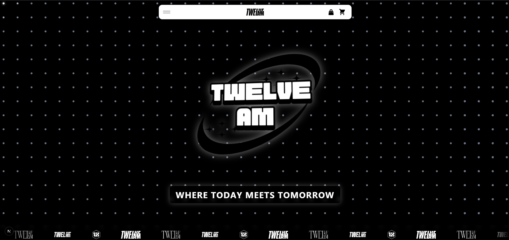

# 🌟 Twelve AM

> **"Where today meets tomorrow"**

Welcome to **Twelve AM** - A premium e-commerce destination offering the latest trends and timeless classics. Experience shopping redefined with our modern, intuitive platform designed for the contemporary lifestyle.

## ✨ Why Choose Twelve AM?

### 🛍️ **Seamless Shopping Experience**
- **Curated Collection** - Handpicked products that define modern style
- **Smart Search & Filters** - Find exactly what you're looking for with advanced filtering
- **Real-time Stock Updates** - Never miss out on your favorite items
- **Mobile-Optimized** - Shop anywhere, anytime on any device
- **Secure Checkout** - Safe and fast payment processing

### 🎯 **What We Offer**
- **Fashion & Lifestyle** - Contemporary clothing and accessories
- **Premium Quality** - Every product meets our high standards
- **Competitive Pricing** - Best value for premium products
- **Fast Delivery** - Quick shipping to your doorstep
- **Customer Support** - Dedicated support team ready to help

### 🌐 **Modern Shopping Features**
- **Interactive Product Gallery** - 360° views and detailed imagery
- **Wishlist & Favorites** - Save items for later
- **Order Tracking** - Real-time updates on your purchases
- **Personalized Recommendations** - Products tailored to your style
- **Easy Returns** - Hassle-free return policy

## 🚀 Visit Twelve AM

**🌍 Live Website:** [12am.laszlo.icu](https://12am.laszlo.icu/)

Start your shopping journey today and discover why Twelve AM is becoming the go-to destination for style-conscious shoppers.

## 📱 Shopping Made Simple

1. **Browse** our curated collections
2. **Add** items to your cart
3. **Checkout** securely
4. **Track** your order
5. **Enjoy** your purchase!

## 🛒 Product Categories

- **New Arrivals** - Latest additions to our collection
- **Trending Now** - Most popular items this season
- **Best Sellers** - Customer favorites
- **Sale Items** - Special offers and discounts

## 💌 Contact Us

Have questions? We're here to help!

- **Email:** support@twelveam.com
- **Hours:** Monday - Friday, 9 AM - 6 PM
- **Response Time:** Within 24 hours

**Follow us for the latest updates and exclusive offers:**
- 📸 Instagram: [@twelveam](https://instagram.com/twelveam)
- 📘 Facebook: [Twelve AM](https://facebook.com/twelveam)
- 🐦 Twitter: [@twelveam](https://twitter.com/twelveam)

**🛍️ Start Shopping Today at [Twelve AM](https://12am.laszlo.icu/)**

## 🛠️ Tech Stack

### **Frontend**
- **Framework**: Next.js 15 with App Router
- **Styling**: TailwindCSS with custom animations
- **UI Components**: Radix UI primitives
- **3D Graphics**: Three.js with React Three Fiber
- **Animations**: Framer Motion & GSAP
- **State Management**: Zustand
- **Form Handling**: React Hook Form with Zod validation

### **Backend**
- **Runtime**: Node.js
- **Database**: PostgreSQL with Prisma ORM
- **Caching**: Redis (Upstash)
- **Authentication**: JWT with bcrypt
- **File Upload**: Custom implementation
- **Rate Limiting**: Upstash Rate Limit

### **DevOps & Deployment**
- **Hosting**: Vercel
- **Database**: PostgreSQL (cloud-hosted)
- **Cache**: Upstash Redis
- **CI/CD**: GitHub Actions
- **Monitoring**: Built-in performance tracking

## 📄 License

This project is licensed under the MIT License - see the [LICENSE](LICENSE) file for details.

## 👨‍💻 Author

**TeHenglay**
- GitHub: [@TeHenglay](https://github.com/TeHenglay)

**🌟 Star this repository if you found it helpful!**
